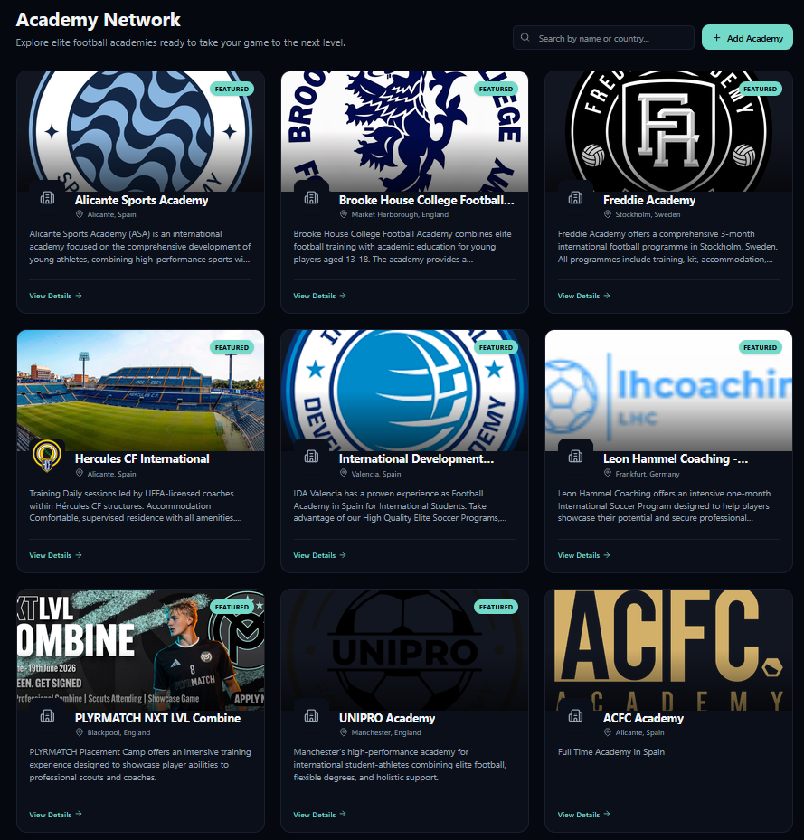
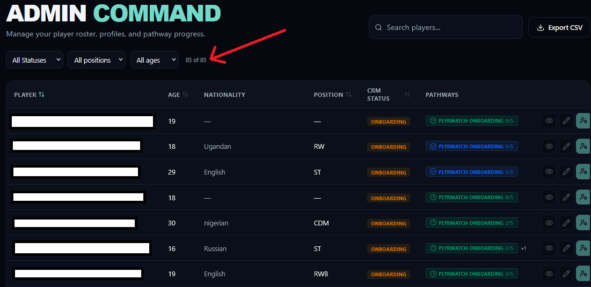
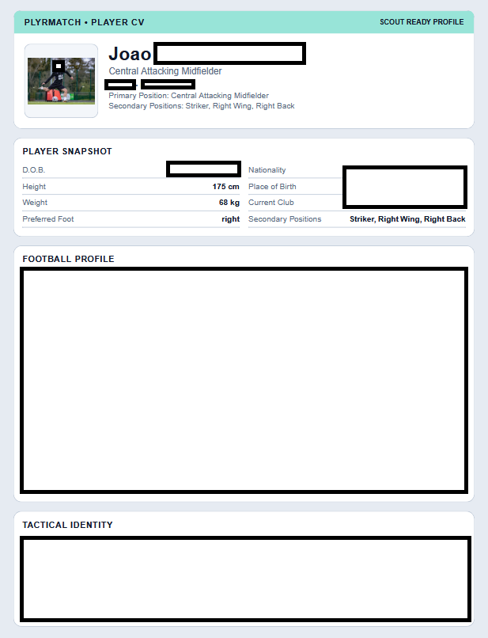
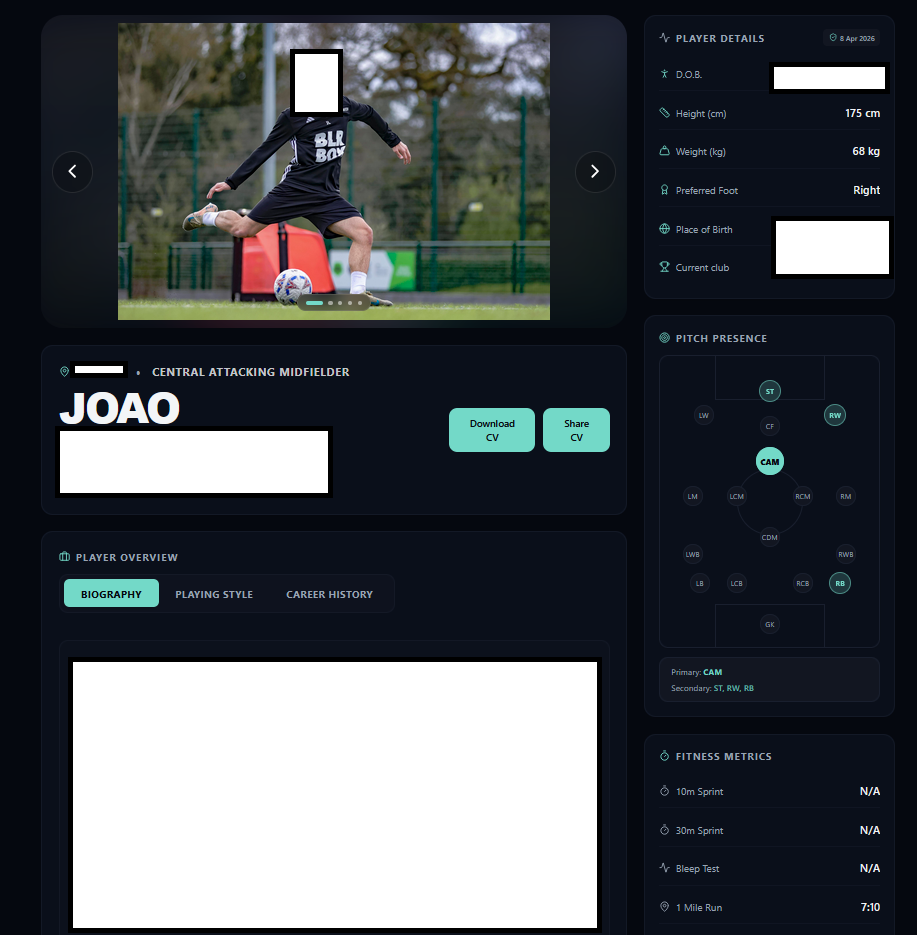
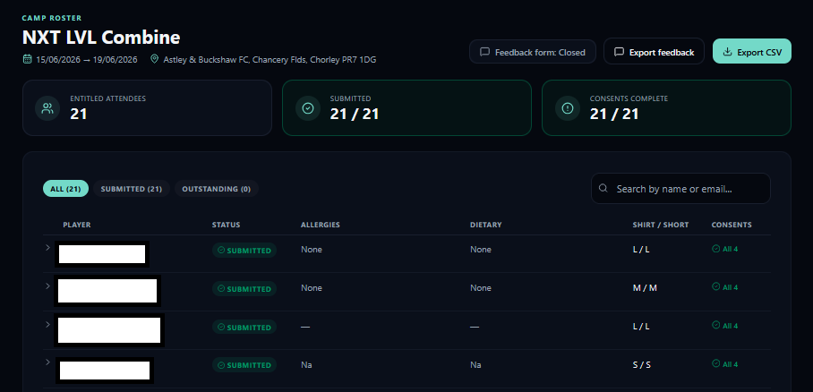
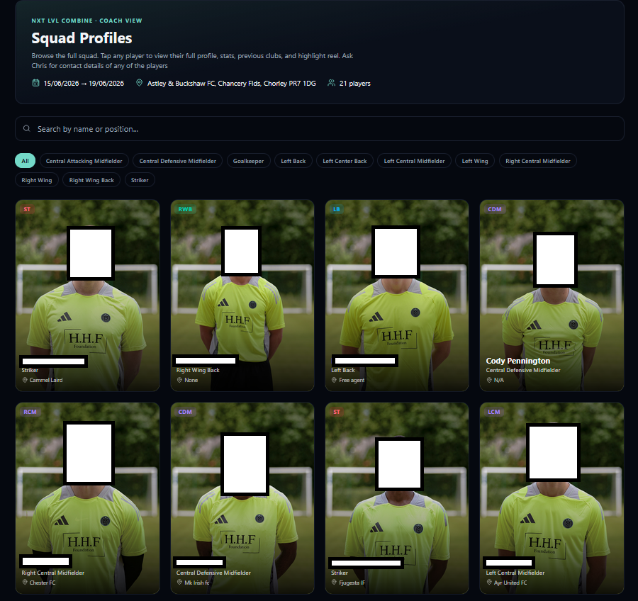

# PLYRMATCH-PORTAL
A live full stack web app connecting football players with scouts and academies. Developed and maintained during a software development internship (Feb 2026 - June 2026)

Live platform: [plyrmatchportal.club](https://plyrmatchportal.club/)

PLYRMatch gives aspiring junior football players a place to build a professional CV, allowing them to be scouted by coaches and academies. Key points include:

- Player profile with video highlights, position visualisation, career history and more
- Coach facing view for the NXTLVL COMBINE camp, with online sign ups, waivers both before and on the day, and GDPR compliant data handling
- Downloadable and shareable player CVs
- Real time updates and ongoing maintenance to the site
- 70 active player profiles, with multiple players being placed at academies

**Stack**
- Frontend: React, Vite, Tailwind CSS
- Backend / Database: Supabase (PostgreSQL + RLS + Auth)
- Deployment: Cloudflare Pages

### Academies

### Admin Dashboard

### Downloadable CV

### Player Profile

### Summer Camp Consents

### Summer Camp Squad Profiles

Note on code: 
The source code for this project belogns to PLYRMatch. This repository functions as a portfolio showcase, with screenshots and a description of the work. The live platform is accesible at the link above
